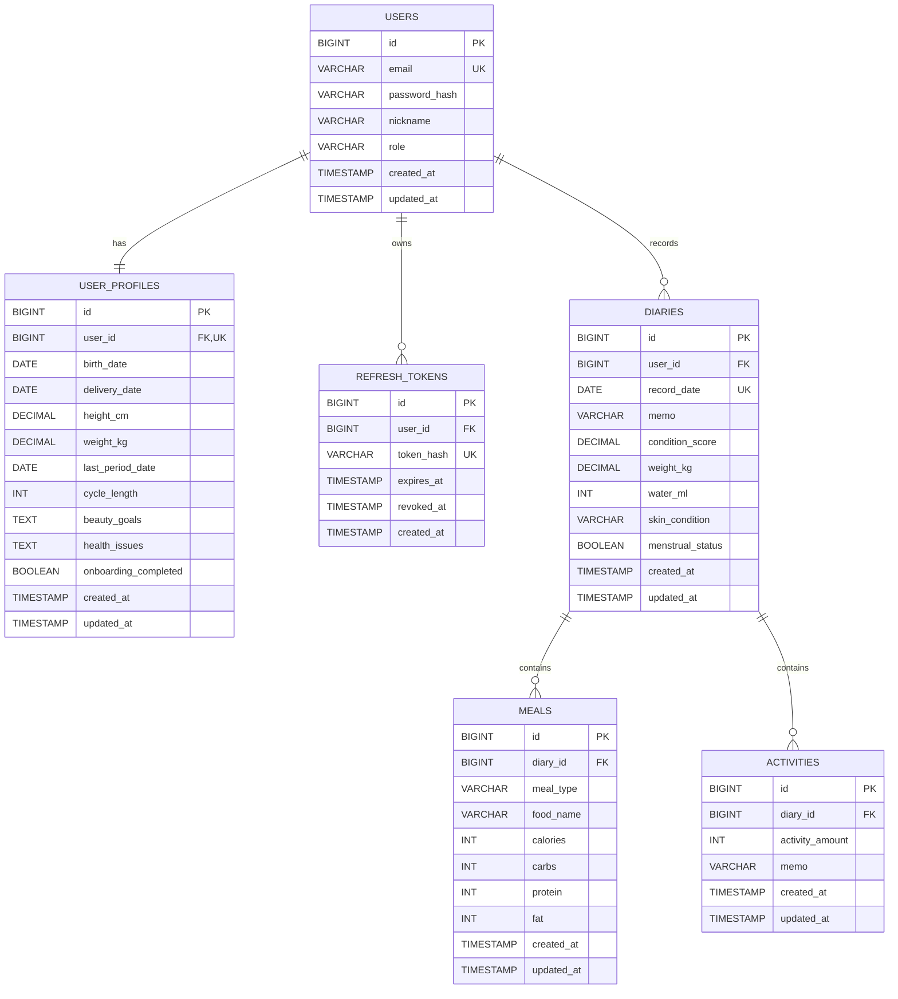

# Bloom Backend

산후 건강·바디케어 앱의 해커톤 MVP 백엔드입니다. 프론트 화면에서 사용하는 필드명을 API 계약의 기준으로 삼습니다.

## 현재 구현 범위

- Java 21 호환, Spring Boot 3.5.5, Gradle 8.14.3
- MySQL 8.4, Spring Data JPA, Flyway
- 회원가입, 로그인, JWT Access Token
- Refresh Token rotation과 로그아웃 폐기
- 날짜별 다이어리 저장·조회
- 식단·활동 생성·수정·삭제
- 총/잔여 칼로리, 영양소, 활동량 및 전일 대비 변화 계산
- Bean Validation과 공통 오류 응답
- Swagger/OpenAPI와 Actuator health
- H2 기반 통합 테스트

## ERD

현재 MVP에서 확정되어 실제 DB와 코드에 반영된 객체만 표시합니다.



- `USERS` ↔ `USER_PROFILES`: 사용자 한 명당 프로필 하나
- `USERS` ↔ `REFRESH_TOKENS`: 사용자 한 명이 로그인 세션별 Refresh Token을 여러 개 보유 가능
- `USERS` ↔ `DIARIES`: 사용자별 하루 한 개의 다이어리
- `DIARIES` ↔ `MEALS`, `ACTIVITIES`: 하루 기록에 식단과 활동을 여러 개 저장

## 프론트 JSON 계약

API 요청·응답 키는 프론트 화면의 명칭을 그대로 사용합니다. DB와 Java 내부에서는 단위를 명확히 하기 위해 `condition_score`, `weight_kg`, `water_ml` 같은 이름을 사용합니다.

| 의미 | JSON 필드 | DB/내부 필드 |
| --- | --- | --- |
| 컨디션 | `condition` | `conditionScore` |
| 체중(kg) | `weight` | `weightKg` |
| 수분 섭취량(ml) | `waterIntake` | `waterMl` |
| 피부 상태 | `skinCondition` | `skinCondition` |
| 생리 여부 | `menstrualStatus` | `menstrualStatus` |
| 활동량 | `activityAmount` | `activityAmount` |

`GET /api/v1/diaries/2026-08-14` 응답 예시:

```json
{
  "date": "2026-08-14",
  "memo": "좋음",
  "condition": 4.5,
  "conditionChange": 0.5,
  "weight": 61.8,
  "waterIntake": 1500,
  "skinCondition": "DRY",
  "menstrualStatus": false,
  "totalCalories": 320,
  "calorieChange": 120,
  "recommendedCalories": 2000,
  "remainingCalories": 1680,
  "totalActivity": 8200,
  "activityChange": -500,
  "carbs": 60,
  "protein": 8,
  "fat": 3,
  "meals": [],
  "activities": []
}
```

- 전날 다이어리가 없으면 `conditionChange`, `calorieChange`, `activityChange`는 `null`
- `remainingCalories = recommendedCalories - totalCalories`
- MVP의 `recommendedCalories`는 임시 기본값 `2000`; 개인화 산식 합의 후 교체

## 로컬 실행

```bash
docker compose up -d
./gradlew bootRun
```

- Swagger UI: `http://localhost:8080/swagger-ui.html`
- Health: `http://localhost:8080/actuator/health`

운영 환경에서는 `.env.example`을 참고해 모든 비밀값을 환경변수로 주입합니다. 실제 비밀값은 저장소에 커밋하지 않습니다.

## 테스트

```bash
./gradlew test
```

현재 통합 테스트는 인증 흐름, Validation 실패, 다이어리 저장, 식단·활동 기록, 일일 계산 응답을 검증합니다.

## 다음 구현

1. 온보딩·프로필 API
2. 달력 기간 조회 API
3. 홈 통합 조회 API
4. AI 식단 분석·추천 API
