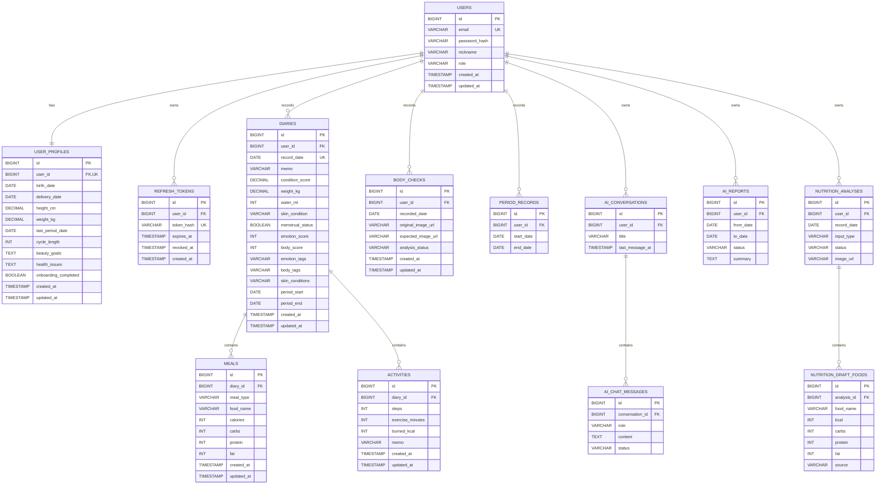

# Bloom Backend


산후 건강·바디케어 앱의 해커톤 MVP 백엔드입니다. 팀에서 확정한 백엔드 JSON 필드명을 API 계약의 기준으로 삼습니다.

> 현재 구현: 인증, 온보딩·프로필, 일일·생리 기록, 식단·활동 CRUD, 인증 이미지 업로드, 눈바디 사진 기록, 마일리지와 AI 챗봇·식단 분석·개인화 추천 식단·눈바디 기반 시술 추천·기간 리포트를 구현했습니다. AI 키가 없거나 제공자 장애가 발생하면 가짜 결과 없이 공통 503을 반환합니다.

## 빠른 시작

필요 환경: Java 21, Docker Desktop

```bash
docker compose up -d
./gradlew bootRun
```

| 용도 | 주소 |
| --- | --- |
| Swagger UI | `http://localhost:8080/swagger-ui.html` |
| OpenAPI JSON | `http://localhost:8080/v3/api-docs` |
| Health check | `http://localhost:8080/actuator/health` |

운영 배포에서는 `DB_URL`, `DB_USERNAME`, `DB_PASSWORD`, `JWT_SECRET`, `CORS_ALLOWED_ORIGINS`, `PUBLIC_BASE_URL`을 반드시 환경변수로 설정합니다. `PUBLIC_BASE_URL`은 외부 HTTPS 백엔드 주소입니다. AI 기능에는 `OPENAI_API_KEY`가 추가로 필요하며 텍스트 모델은 `OPENAI_MODEL`, 눈바디 이미지 편집 모델은 `OPENAI_IMAGE_MODEL`로 변경할 수 있습니다. 기본값은 각각 `gpt-5.6-terra`, `gpt-image-2`입니다. Railway는 저장소 루트의 `Dockerfile`과 `railway.json`을 사용하며, `PORT` 환경변수는 자동 반영됩니다.

기본 로컬 DB 계정은 `compose.yml`과 일치합니다. 운영 환경에서는 `.env.example`을 참고해 비밀값을 환경변수로 주입하며 실제 `.env`는 커밋하지 않습니다.

## 현재 구현 범위

- Java 21 호환, Spring Boot 3.5.5, Gradle 8.14.3
- MySQL 8.4, Spring Data JPA, Flyway
- 회원가입, 로그인, JWT Access Token
- Refresh Token rotation과 로그아웃 폐기
- 온보딩, 내 프로필 조회·부분 수정, 회원 탈퇴
- 날짜별 다이어리 저장·조회
- 합의 명세의 일일 기록 부분 수정과 기간 이력 조회
- 식단·활동 생성·수정·삭제
- 감정·신체 점수와 태그 기반 컨디션 기록
- 걸음 수·운동 시간·소모 칼로리를 분리한 활동 기록
- 눈바디 원본 이미지 URL과 촬영일 기록 CRUD
- 생리 시작일·종료일 기록 CRUD
- AI 챗봇과 사용자별 대화 기록
- 사진·텍스트 식단 AI 분석, 임시 결과 편집, 일반 식단 기록
- 프로필·최근 14일 기록 기반 AI 추천 식단
- 눈바디 이미지·사용자 목표 기반 시술 추천
- 컨디션·식단·활동·피부·생리 기록 기반 기간 AI 리포트
- 총/잔여 칼로리, 영양소, 활동량 및 전일 대비 변화 계산
- Bean Validation과 공통 오류 응답
- Swagger/OpenAPI와 Actuator health
- H2 기반 통합 테스트

## API 구현 상태

기본 경로는 `/api/v1`입니다. 로그인·회원가입·재발급 외 API에는 `Authorization: Bearer <accessToken>`이 필요합니다.

| 도메인 | Method | Endpoint | 상태 |
| --- | --- | --- | --- |
| 인증 | POST | `/auth/signup` | ✅ 완료 |
| 인증 | POST | `/auth/login` | ✅ 완료 |
| 인증 | POST | `/auth/session` (`REISSUE`, `LOGOUT`) | ✅ 합의 경로 |
| 사용자 | POST | `/onboarding` | ✅ 완료 |
| 사용자 | GET / PATCH | `/users/me/profile` | ✅ 완료 |
| 사용자 | DELETE | `/users/me` | ✅ 완료 |
| 다이어리 | GET / PATCH | `/diary/daily` | ✅ 합의 경로 |
| 다이어리 | GET | `/diary/history?from=...&to=...` | ✅ 완료 |
| 식단 | POST | `/diaries/{date}/meals` | ✅ 완료 |
| 식단 | PATCH / DELETE | `/meals/{mealId}` | ✅ 완료 |
| 활동 | POST | `/diaries/{date}/activities` | ✅ 완료 |
| 활동 | PATCH / DELETE | `/activities/{activityId}` | ✅ 완료 |
| 생리 기록 | POST / GET | `/periods` | ✅ 완료 |
| 생리 기록 | PATCH / DELETE | `/periods/{periodId}` | ✅ 완료 |
| 눈바디 | POST / GET | `/care/body-checks` | ✅ 사진 기록 완료 |
| 눈바디 | GET / PATCH / DELETE | `/care/body-checks/{bodyCheckId}` | ✅ 사진 기록 완료 |
| 호환 API | POST | `/auth/reissue`, `/auth/logout` | ✅ 유지 |
| 호환 API | GET / PUT | `/diaries/{date}` | ✅ 유지 |
| AI 식단 분석 | POST | `/ai/nutrition/analyses` | ✅ 사진·텍스트 완료 |
| AI 식단 초안 | GET / PATCH / POST / DELETE | `/ai/nutrition/analyses/...` | ✅ 편집·기록 완료 |
| AI 추천 식단 | POST | `/ai/meals/recommendations` | ✅ 개인화 추천 완료 |
| AI 챗봇 | POST / GET | `/ai/chat`, `/ai/conversations...` | ✅ 완료 |
| AI 리포트 | POST / GET | `/ai/reports...` | ✅ 완료 |
| AI 추천 시술 | POST | `/ai/procedures/recommendations` | ✅ 완료 |
| 눈바디 AI 예상 이미지 | POST | `/care/body-checks/{bodyCheckId}/analysis` | ✅ 완료 |

`/auth/reissue`, `/auth/logout`, `/diaries/{date}`는 기존 프론트·테스트 호환을 위해 당분간 유지합니다. 프론트 전환이 끝난 뒤 제거 여부를 팀에서 결정합니다.

## ERD

현재 MVP에서 확정되어 실제 DB와 코드에 반영된 객체만 표시합니다.



- `USERS` ↔ `USER_PROFILES`: 사용자 한 명당 프로필 하나
- `USERS` ↔ `REFRESH_TOKENS`: 사용자 한 명이 로그인 세션별 Refresh Token을 여러 개 보유 가능
- `USERS` ↔ `DIARIES`: 사용자별 하루 한 개의 다이어리
- `DIARIES` ↔ `MEALS`, `ACTIVITIES`: 하루 기록에 식단과 활동을 여러 개 저장
- `USERS` ↔ `BODY_CHECKS`: 사용자별 눈바디 사진 기록. AI 예상 이미지는 추후 같은 기록에 연결

## 합의된 일일 기록 JSON 계약

API 요청·응답 키는 프론트 화면의 명칭을 그대로 사용합니다. DB와 Java 내부에서는 단위를 명확히 하기 위해 `condition_score`, `weight_kg`, `water_ml` 같은 이름을 사용합니다.

| 의미 | JSON 필드 | DB/내부 필드 |
| --- | --- | --- |
| 체중(kg) | `weightKg` | `weightKg` |
| 감정 상태 점수 | `emotionScore` | `emotionScore` |
| 신체 상태 점수 | `bodyScore` | `bodyScore` |
| 감정 태그 | `emotionTags` | `emotionTags` |
| 신체 태그 | `bodyTags` | `bodyTags` |
| 수분 섭취량(ml) | `waterMl` | `waterMl` |
| 피부 상태 목록 | `skin` | `skinConditions` |
| 생리 기간 | `periodStart`, `periodEnd` | 동일 |
| 메모 | `memo` | `memo` |
| 걸음 수 | `steps` | `steps` |
| 운동 시간(분) | `exerciseMinutes` | `exerciseMinutes` |
| 소모 칼로리 | `burnedKcal` | `burnedKcal` |

`PATCH /api/v1/diary/daily` 요청 예시:

```json
{
  "date": "2026-08-14",
  "weightKg": 61.8,
  "emotionScore": 5,
  "bodyScore": 3,
  "emotionTags": ["HAPPY", "STRESS"],
  "bodyTags": ["BACK_PAIN"],
  "waterMl": 1500,
  "skin": ["DRY", "SENSITIVE"],
  "periodStart": "2026-08-14",
  "periodEnd": "2026-08-18",
  "memo": "회복 중"
}
```

- `PATCH`는 전달한 값만 바꾸며 해당 날짜 기록이 없으면 생성합니다.
- `emotionScore`, `bodyScore`는 정수 `0~5`; `0`은 나쁜 상태이고 미기록은 `null`입니다.
- 스트레스와 피로도는 별도 숫자 필드 없이 `emotionTags`, `bodyTags`의 태그로 표현합니다.
- `GET /diary/daily`의 `date`를 생략하면 한국 시간 기준 오늘을 조회합니다.
- `GET /diary/history`는 `from`, `to`를 모두 받으며 시작일이 종료일보다 늦으면 400을 반환합니다.
- 전날 다이어리가 없으면 `calorieChange`, `stepsChange`, `exerciseMinutesChange`, `burnedKcalChange`는 `null`
- `remainingCalories = recommendedCalories - totalCalories`
- MVP의 `recommendedCalories`는 임시 기본값 `2000`; 개인화 산식 합의 후 교체

## 테스트

```bash
./gradlew clean test bootJar
```

현재 통합 테스트는 기존 인증·다이어리 흐름과 함께 세션 API, 온보딩·프로필, 일일·생리 기록, 이미지·마일리지, AI 성공/실패와 식단 기록 흐름을 검증합니다.

## 프로젝트 구조

```text
src/main/java/com/bloom/backend
├── auth       # JWT 인증과 Refresh Token
├── ai         # 챗봇·식단 분석·리포트·시술 추천
├── care       # 눈바디 기록
├── diary      # 다이어리·식단·활동과 계산
├── period     # 생리 기간 기록
├── upload     # 인증 이미지와 보관 정책
├── user       # 사용자·온보딩 프로필
└── global     # 설정, 공통 Entity, 예외 처리
```

DB 변경은 JPA 자동 생성이 아니라 `src/main/resources/db/migration`의 Flyway SQL로 관리합니다.

프론트 연동에 사용하는 확정 필드와 enum 목록은 [MVP API 명세](docs/API_SPEC.md)를 기준으로 합니다.
AI 기능은 [AI API 구현 명세](docs/AI_API_DRAFT.md)에 공개 계약과 모델 호출·실패 정책을 정리합니다.

## 협업 규칙

- 외부 JSON 필드 변경은 프론트 타입, Swagger, README, MVP 명세를 함께 수정합니다.
- 외부 JSON은 `foodName`, `kcal`, `carbs`, `protein`, `fat`을 사용합니다. DB 칼럼명 `calories`는 내부 구현이므로 API에 노출하지 않습니다.
- 계산값은 DB에 중복 저장하지 않고 조회 시 계산합니다.
- `main`에는 테스트와 `bootJar` 생성이 통과한 코드만 반영합니다.
- 자세한 브랜치·PR·계약 변경 절차는 [CONTRIBUTING.md](CONTRIBUTING.md)를 따릅니다.

## 아직 합의가 더 필요한 기능

1. AI 식단 분석 구현: 사진/텍스트 개별 입력, `DRAFT` 편집 후 `기록하기`로 식단 저장
2. AI 식단 분석의 타임아웃·재시도와 최소 개인화 정보
3. 눈바디 실제 파일 저장소와 AI 예상 이미지 생성 API
4. 추천 시술의 필드와 추천 근거. 실제 병원·예약·결제는 제외
5. 태그와 목표·건강 문제 enum의 실제 허용값
6. 커뮤니티·광고·결제·마일리지·구독·병원 예약·제휴 구매·알림은 이번 MVP 범위에서 제외
