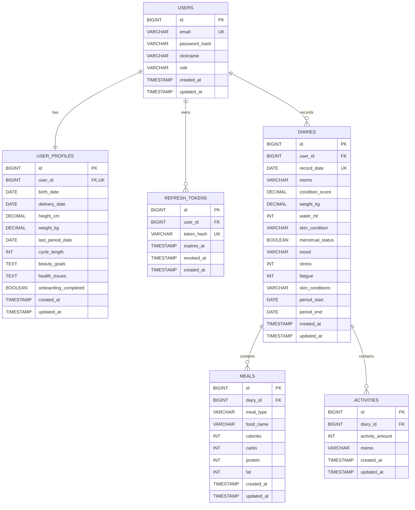

# Bloom Backend


산후 건강·바디케어 앱의 해커톤 MVP 백엔드입니다. 프론트 화면에서 사용하는 필드명을 API 계약의 기준으로 삼습니다.

> 현재 `main`: 프론트–백엔드 합의 명세 중 인증 세션, 온보딩·프로필, 회원 탈퇴, 일일 기록·기간 조회와 기존 식단·활동 CRUD를 구현했습니다. AI·홈·케어 기능은 계약 확정 후 구현합니다.

## 빠른 시작

필요 환경: Java 21, Docker Desktop

```bash
docker compose up -d
./gradlew bootRun
```

| 용도 | 주소 |
| --- | --- |
| Swagger UI | `http://localhost:8080/swagger-ui.html` |
| OpenAPI JSON | `http://localhost:8080/v3/api-docs` |
| Health check | `http://localhost:8080/actuator/health` |

기본 로컬 DB 계정은 `compose.yml`과 일치합니다. 운영 환경에서는 `.env.example`을 참고해 비밀값을 환경변수로 주입하며 실제 `.env`는 커밋하지 않습니다.

## 현재 구현 범위

- Java 21 호환, Spring Boot 3.5.5, Gradle 8.14.3
- MySQL 8.4, Spring Data JPA, Flyway
- 회원가입, 로그인, JWT Access Token
- Refresh Token rotation과 로그아웃 폐기
- 온보딩, 내 프로필 조회·부분 수정, 회원 탈퇴
- 날짜별 다이어리 저장·조회
- 합의 명세의 일일 기록 부분 수정과 기간 이력 조회
- 식단·활동 생성·수정·삭제
- 총/잔여 칼로리, 영양소, 활동량 및 전일 대비 변화 계산
- Bean Validation과 공통 오류 응답
- Swagger/OpenAPI와 Actuator health
- H2 기반 통합 테스트

## API 구현 상태

기본 경로는 `/api/v1`입니다. 로그인·회원가입·재발급 외 API에는 `Authorization: Bearer <accessToken>`이 필요합니다.

| 도메인 | Method | Endpoint | 상태 |
| --- | --- | --- | --- |
| 인증 | POST | `/auth/signup` | ✅ 완료 |
| 인증 | POST | `/auth/login` | ✅ 완료 |
| 인증 | POST | `/auth/session` (`REISSUE`, `LOGOUT`) | ✅ 합의 경로 |
| 사용자 | POST | `/onboarding` | ✅ 완료 |
| 사용자 | GET / PATCH | `/users/me/profile` | ✅ 완료 |
| 사용자 | DELETE | `/users/me` | ✅ 완료 |
| 다이어리 | GET / PATCH | `/diary/daily` | ✅ 합의 경로 |
| 다이어리 | GET | `/diary/history?from=...&to=...` | ✅ 완료 |
| 식단 | POST | `/diaries/{date}/meals` | ✅ 완료 |
| 식단 | PATCH / DELETE | `/meals/{mealId}` | ✅ 완료 |
| 활동 | POST | `/diaries/{date}/activities` | ✅ 완료 |
| 활동 | PATCH / DELETE | `/activities/{activityId}` | ✅ 완료 |
| 호환 API | POST | `/auth/reissue`, `/auth/logout` | ✅ 유지 |
| 호환 API | GET / PUT | `/diaries/{date}` | ✅ 유지 |
| AI 식단 분석 | POST | `/ai/nutrition` | 🟡 계약 보완 필요 |
| 식단 원본 입력 | POST | `/diary/meals` (image/text) | 🟡 저장·응답 정책 필요 |
| 홈·케어·AI 챗봇 | - | `/home`, `/care/...`, `/ai/...` | 🟡 미구현 |

`/auth/reissue`, `/auth/logout`, `/diaries/{date}`는 기존 프론트·테스트 호환을 위해 당분간 유지합니다. 프론트 전환이 끝난 뒤 제거 여부를 팀에서 결정합니다.

## ERD

현재 MVP에서 확정되어 실제 DB와 코드에 반영된 객체만 표시합니다.



- `USERS` ↔ `USER_PROFILES`: 사용자 한 명당 프로필 하나
- `USERS` ↔ `REFRESH_TOKENS`: 사용자 한 명이 로그인 세션별 Refresh Token을 여러 개 보유 가능
- `USERS` ↔ `DIARIES`: 사용자별 하루 한 개의 다이어리
- `DIARIES` ↔ `MEALS`, `ACTIVITIES`: 하루 기록에 식단과 활동을 여러 개 저장

## 합의된 일일 기록 JSON 계약

API 요청·응답 키는 프론트 화면의 명칭을 그대로 사용합니다. DB와 Java 내부에서는 단위를 명확히 하기 위해 `condition_score`, `weight_kg`, `water_ml` 같은 이름을 사용합니다.

| 의미 | JSON 필드 | DB/내부 필드 |
| --- | --- | --- |
| 체중(kg) | `weightKg` | `weightKg` |
| 기분 | `mood` | `mood` |
| 스트레스 | `stress` | `stress` |
| 피로도 | `fatigue` | `fatigue` |
| 수분 섭취량(ml) | `waterMl` | `waterMl` |
| 피부 상태 목록 | `skin` | `skinConditions` |
| 생리 기간 | `periodStart`, `periodEnd` | 동일 |
| 메모 | `note` | `memo` |
| 활동량 | `activityAmount` | `activityAmount` |

`PATCH /api/v1/diary/daily` 요청 예시:

```json
{
  "date": "2026-08-14",
  "weightKg": 61.8,
  "mood": "GOOD",
  "stress": 3,
  "fatigue": 4,
  "waterMl": 1500,
  "skin": ["DRY", "SENSITIVE"],
  "periodStart": "2026-08-14",
  "periodEnd": "2026-08-18",
  "note": "회복 중"
}
```

- `PATCH`는 전달한 값만 바꾸며 해당 날짜 기록이 없으면 생성합니다.
- `GET /diary/daily`의 `date`를 생략하면 한국 시간 기준 오늘을 조회합니다.
- `GET /diary/history`는 `from`, `to`를 모두 받으며 시작일이 종료일보다 늦으면 400을 반환합니다.
- 전날 다이어리가 없으면 `calorieChange`, `activityChange`는 `null`
- `remainingCalories = recommendedCalories - totalCalories`
- MVP의 `recommendedCalories`는 임시 기본값 `2000`; 개인화 산식 합의 후 교체

## 테스트

```bash
./gradlew clean test bootJar
```

현재 통합 테스트는 기존 인증·다이어리 흐름과 함께 합의된 세션 API, 온보딩·프로필, 일일 기록 PATCH/GET, 기간 조회를 검증합니다.

## 프로젝트 구조

```text
src/main/java/com/bloom/backend
├── auth       # JWT 인증과 Refresh Token
├── diary      # 다이어리·식단·활동과 계산
├── user       # 사용자·온보딩 프로필
└── global     # 설정, 공통 Entity, 예외 처리
```

DB 변경은 JPA 자동 생성이 아니라 `src/main/resources/db/migration`의 Flyway SQL로 관리합니다.

## 협업 규칙

- 외부 JSON 필드 변경은 프론트 타입, Swagger, README, MVP 명세를 함께 수정합니다.
- `skinCondition`, `menstrualStatus`, `activityAmount` 정책은 팀 합의 전 추가 확장하지 않습니다.
- 계산값은 DB에 중복 저장하지 않고 조회 시 계산합니다.
- `main`에는 테스트와 `bootJar` 생성이 통과한 코드만 반영합니다.
- 자세한 브랜치·PR·계약 변경 절차는 [CONTRIBUTING.md](CONTRIBUTING.md)를 따릅니다.

## 아직 합의가 더 필요한 기능

1. `/diary/meals`의 이미지 업로드 방식, 원본 보관 여부, AI 분석 결과와 저장의 경계
2. `/ai/nutrition`의 응답 필드, 실패·재시도·요청 제한, 파일 크기 정책
3. `mood`, `skin`, 목표·건강 문제 등 enum의 실제 허용값
4. 홈·케어·AI 챗봇의 화면별 응답 JSON과 AI 제공자
5. 커뮤니티·광고·결제·마일리지·구독·병원 예약·제휴 구매·알림은 이번 MVP 범위에서 제외
